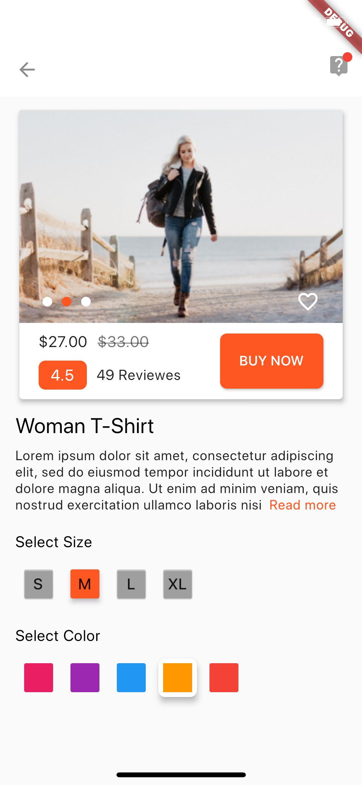
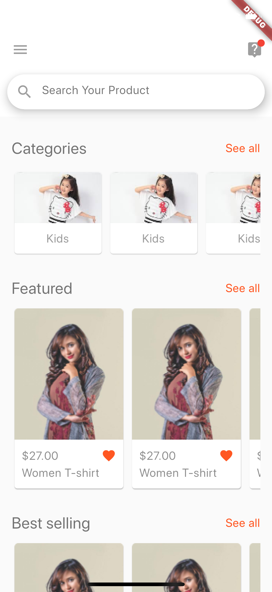
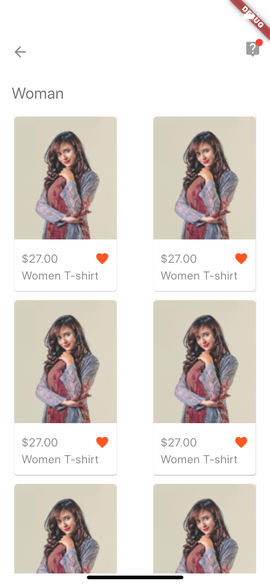
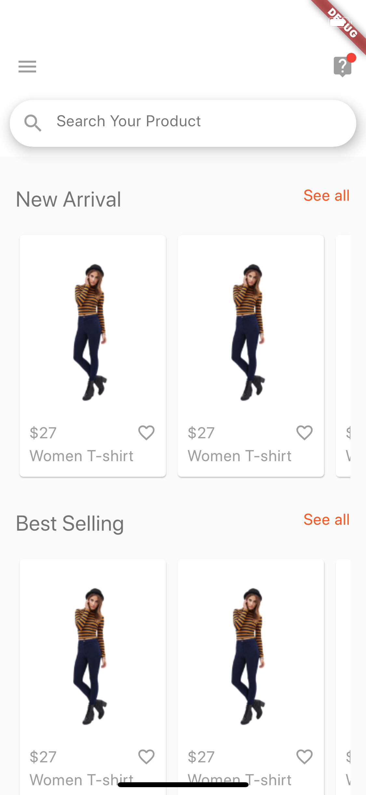

# E-commerce app UI kit
This is an implementation using [Flutter](https://flutter.dev/) of a design I found on uplabs.com

[Design files](https://www.uplabs.com/posts/e-commerce-app-ui-kit-034c07f3-63d1-449b-a230-1ef3b1fc68e4)

### Screenshots

